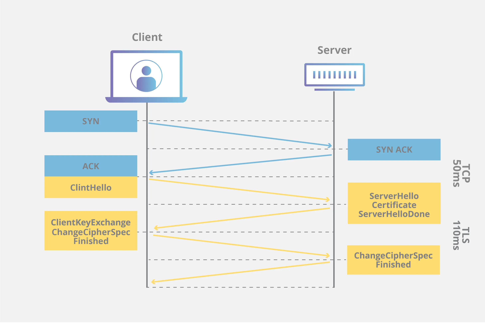
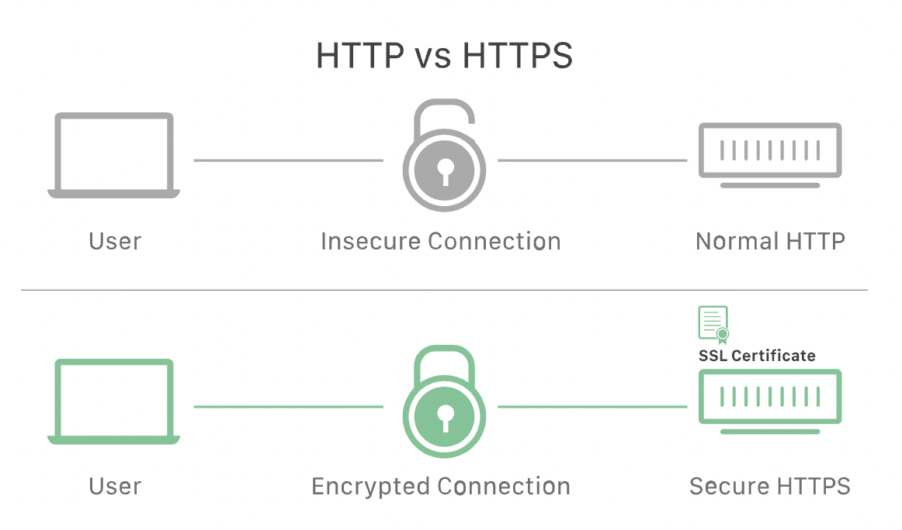
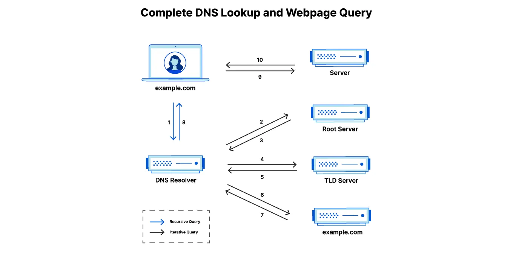

이미지에서 보이듯 사용자와 가장 가까운 계층인 응용계층에 대해 정리하려고 해요.

### 응용계층이란?

응용계층은 네트워크 스택의 **최상위 계층**으로, 실질적으로 사용자가 네트워크와 만나는 지점이에요.

브라우저, 이메일, 스트리밍 앱처럼 우리가 직접 사용하는 모든 소프트웨어는 결국 응용계층의 프로토콜을 이용해 네트워크와 데이터를 주고받아요.

여기서 중요한 점은, 응용계층은 단순히 서비스가 올려진 계층이 아니라, 애플리케이션이 네트워크 기능을 사용할 수 있게 도와주는 프로토콜과 인터페이스의 집합이라는 점이에요.

- 사용자가 어떤 데이터를 전송하고자 할 때 그 데이터가 어떤 형식으로 표현되어야 하는지
- 어떤 명령을 어떤 순서로 주고받아야 하는지
- 상대방 애플리케이션이 이를 어떻게 이해해야 하는지
- 상호작용에 필요한 규칙과 의미는 무엇인지

이 모든 것을 결정하는 것이 바로 응용계층이에요.

---

### 응용 계층의 주요 프로토콜

### 🌐 HTTP/HTTPS

### HTTP? (HyperText Transfer Protocol)

HTTP는 웹에서 데이터를 주고받기 위한 응용계층 프로토콜이에요.

1990년대 웹 초기부터 사용되었고, 오늘날 모든 웹 서비스의 기본 통신 체계가 돼요.

> "브라우저와 서버가 서로 이야기하는 규칙"

**HTTP의 핵심 특징**

1. **요청–응답(Request–Response) 구조**

   클라이언트(브라우저)가 요청을 보내고 서버가 응답을 돌려주는 단순한 구조예요.

   ```
   Client → Request → Server
   Client ← Response ← Server
   ```

2. **Stateless(무상태)**

   서버는 요청 간의 상태를 기억하지 않아요.

   이 때문에 개발자는 세션/쿠키/JWT 같은 기술로 상태를 관리해요.

3. **텍스트 기반 프로토콜**

   사람이 읽을 수 있을 정도로 직관적 포맷이에요.

4. **확장 가능한 구조**

   헤더 기반 구조라서 매우 다양한 기능을 붙일 수 있어요.

**HTTP 메시지 구조**

**→ HTTP Request 예시**

```
GET /users HTTP/1.1
Host: example.com
User-Agent: Chrome/121
Accept: application/json
```

**→ HTTP Response 예시**

```
HTTP/1.1 200 OK
Content-Type: application/json
Content-Length: 29

{"id": 1, "name": "Alice"}
```

**구성 요소**

1. **Start Line**
   - 요청: `GET /path HTTP/1.1`
   - 응답: `HTTP/1.1 200 OK`
2. **Headers**
   - 메타데이터(인증, 캐싱, 쿠키, Content-Type 등)
3. **Body**

   JSON, HTML, 이미지 등

**HTTP 버전의 발전**

**HTTP/1.0**

- 요청 하나당 TCP 연결 하나
- 비효율적

**HTTP/1.1**

- Keep-Alive로 하나의 TCP 연결 재사용
- 오늘날 가장 보편적

**HTTP/2**

- 다중화(Multiplexing) 지원 → 병렬 요청 가능
- 헤더 압축(HPACK)

**HTTP/3**

- TCP 대신 QUIC(UDP 기반)
- 더 빠르고 안정적, 모바일에 최적화

프론트엔드에서 성능 최적화는 대부분 이 계층의 최적화 전략과 연결돼요.

### HTTPS? (HTTP over TLS)

HTTPS는 HTTP에 TLS(Transport Layer Security)를 적용한 것이에요.

> "HTTP는 평문 통신이고, HTTPS는 암호화된 HTTP 통신이다."

브라우저 주소창에 `https://`가 보인다면, 데이터가 암호화된 형태로 전달된다는 뜻이에요.

**HTTPS 특징**

1. **기밀성(Confidentiality)**

   데이터가 암호화되어 중간에서 내용을 볼 수 없어요.

2. **무결성(Integrity)**

   전달 중에 데이터가 변경되면 감지되어요.

   (해시·MAC 기반 검증)

3. **인증(Authentication)**

   클라이언트는 이 서버가 진짜 서버인지 확인 가능

   → 인증서는 신뢰 사슬(Certificate Chain)에 의해 검증되어요.

**HTTPS 동작 (TLS Handshake Deep Dive)**

HTTPS가 단순히 암호화된 HTTP라고 했지만, 그 밑에는 꽤 복잡한 TLS 과정이 있어요.



사용자가 브라우저 주소창에 `https://www.naver.com`을 입력하고 엔터를 치는 순간, 응용 계층의 데이터가 날아가기 전에 두 번의 중요한 Handshake가 선행돼요. 첨부된 이미지는 이 과정을 시간 순서대로 아주 잘 보여주고 있어요.

1. **TCP 3-way Handshake**

   이미지의 윗부분(파란색 영역)을 보세요. HTTPS도 결국 TCP 기반의 프로토콜이기 때문에, 가장 먼저 서버와 물리적/논리적 연결을 맺어야 해요.

   - SYN: 클라이언트가 서버에게 "문 열어주세요, 대화 좀 합시다!"라고 노크를 해요.
   - SYN ACK: 서버가 "네, 들어오세요. 준비됐습니다."라고 응답하며 문을 열어줘요.
   - ACK: 클라이언트가 "확인했습니다, 들어갈게요."라고 답하며 연결이 성립돼요.

   > 포인트는 이 과정이 끝나야 비로소 데이터가 오갈 수 있는 Connection이 뚫린 거예요. 하지만 아직 이 도로 위를 지나는 차들은 투명해서 누구나 내부를 볼 수 있는 상태(HTTP)예요.

2. **TLS Handshake**

   이미지의 아랫부분(노란색 영역)이 바로 HTTPS의 핵심인 TLS Handshake예요. 암호화를 하는 과정이라고 보시면 돼요.

   1. Hello
      - ClientHello: 브라우저가 먼저 서버에게 정보를 건네줘요.
        - "나는 TLS 1.2, 1.3 버전을 지원해"
        - "나는 이런 암호화 방식(Cipher Suite)들을 사용할 수 있어"
        - "그리고 나중에 쓸 난수(Random data)도 여기 있어"
      - ServerHello: 서버가 그중에서 가장 안전한 방식을 선택해서 답장을 보내요.
        - "그래, 그럼 우리 TLS 1.3으로 대화하고, 암호화 방식은 이걸로 하자"
   2. **Certificate**

      - Certificate: 서버는 자신의 신분증인 SSL/TLS 인증서를 클라이언트에게 보내요.
      - ServerHelloDone: "내 소개는 끝났어"라고 신호를 보내요.

      > 여기서, 브라우저는 서버가 보낸 인증서가 위조되지 않았는지 꼼꼼히 검사해요.
      >
      > - 믿을 수 있는 기관(CA)에서 발급했는지
      > - 지금 접속하려는 도메인과 인증서의 주인이 일치하는지
      > - 유효 기간은 지나지 않았는지
      >
      > 이 검사를 통과해야만 브라우저 주소창에 자물쇠 아이콘🔒이 안전하게 표시돼요.

   3. **ClientKeyExchange**
      - 가장 중요한 단계예요! 클라이언트는 서버가 보낸 인증서 안의 공개키(Public Key)를 이용해, 앞으로 대화에 사용할 대칭키(Session Key)를 만들 정보를 암호화해서 서버에 보내요.
      - 이 정보는 오직 서버만이 가진 개인키(Private Key)로만 풀 수 있어서 중간에 누가 가로채도 절대 열쇠를 알 수 없어요.
   4. **ChangeCipherSpec**
      - ChangeCipherSpec: 이제 양쪽 모두 "자, 이제부터 진짜 암호화해서 말한다!"라고 선언해요.
      - Finished: 지금까지의 핸드셰이크 과정이 변조되지 않았는지 최종 확인해요.

### HTTP vs HTTPS 차이



| 구분             | HTTP                  | HTTPS                 |
| ---------------- | --------------------- | --------------------- |
| 암호화           | 없음(평문)            | TLS 암호화            |
| 포트             | 80번                  | 443번                 |
| 보안 수준        | 낮음                  | 높음                  |
| SEO              | 불리함                | 구글에서 우대         |
| 쿠키             | Secure 옵션 사용 불가 | Secure 옵션 사용 가능 |
| 데이터 변조 방지 | 없음                  | 가능                  |

요약하면 HTTPS는 HTTP를 안전하게 만든 버전이에요.

오늘날 HTTP는 거의 쓰지 않아요.

> HTTP는 도청, 중간자 공격(MITM), 변조에 취약해서 보안 측면에서 사용할 수가 없어요.

SPA, REST, GraphQL 같은 현대 프론트엔드 환경에서는 HTTPS가 반드시 필요해요.

### 프론트엔드에서 HTTP/HTTPS

Fetch / Axios 요청은 사실 HTTP 메시지를 구성하는 과정이에요.

```jsx
fetch("/api/user", {
  method: "POST",
  headers: { "Content-Type": "application/json" },
  body: JSON.stringify({ name: "Alice" }),
});
```

이 한 줄이 내부적으로 HTTP Request를 만드는 것이고,

브라우저는 HTTPS면 TLS Handshake까지 자동으로 수행해요.

또한,

1. **인증 정보는 반드시 HTTPS가 필요해요**

   프론트엔드에서 자주 사용하는 인증 방식:

   - `Authorization: Bearer <token>`
   - 세션 기반 로그인(Session ID)
   - Cookie 기반 인증

   이 모든 민감한 데이터는 HTTPS를 통해 암호화되어 전송돼요.

   HTTP에서 전송하면 네트워크에서 그대로 노출되기 때문에 도청·탈취가 너무 쉬워요.

   **→ HTTPS = 인증 토큰을 안전하게 보내기 위한 최소 조건이에요.**

2. **쿠키 보안 옵션도 HTTPS 의존적이에요**

   특히 인증 쿠키(Session Cookie)는 다음 옵션들이 중요해요:

   - **Secure:** HTTPS에서만 전송
   - **HttpOnly:** JS에서 접근 불가(XSS 방어)
   - **SameSite:** CSRF 방어

   HTTP에서는 쿠키가 평문으로 전송되어 세션 탈취(Session Hijacking) 위험이 커요.

   **→ 현대적인 인증 방식(Cookie + JWT)은 사실상 HTTPS 없이는 안전하게 동작할 수 없음**

3. **최신 웹 기능 대부분이 HTTPS를 요구해요.**

   웹 API들 중 많은 기능은 보안상의 이유로 HTTPS 전용이에요.

   - Service Worker
   - Geolocation
   - Clipboard API
   - Bluetooth

   **→ HTTP는 최신 프론트엔드 기능을 제대로 사용할 수 없음**

4. **SEO·브라우저 정책에서도 HTTPS는 사실상 필수로 여겨져요.**

   - 구글은 HTTPS 사이트에 SEO 가산점을 줌
   - 브라우저는 HTTP 사이트에 “Not secure(안전하지 않음)” 경고를 띄움
   - 평문 HTTP는 MITM 공격에 지나치게 취약하기 때문에 보안 측면에서 사실상 사용이 불가

   **→ HTTP를 그대로 노출하는 웹사이트는 더 이상 정상적인 서비스로 취급되지 않아요.**

HTTP, HTTPS를 요약하면,

- HTTP는 웹의 기본 통신 규칙
- HTTPS는 HTTP + TLS → 암호화/인증/무결성
- HTTP는 평문이라 보안 취약
- HTTPS는 안전하고 현대 웹에 필수
- CORS, Cookie, Authorization, Fetch 등 모든 API 통신이 HTTP/HTTPS 기반

---

### 🌐 SMTP, IMAP, POP

SMTP, IMAP, POP는 이메일 서비스를 구성하는 3대 프로토콜이에요.

하나의 앱에서 모두 쓰일 수도 있지만, 다 다른 역할을 하고 있어요.

1. SMTP → 메일을 보내는 프로토콜
2. IMAP → 메일을 서버와 동기화하며 읽는 프로토콜
3. POP → 메일을 다운로드하여 읽는 프로토콜

### **SMTP(Simple Mail Transfer Protocol)**

단순 전자우편 전송 프로토콜(SMTP)은 네트워크를 통해 전자우편(이메일)을 전송하는 기술 표준이에요. 다른 네트워킹 프로토콜과 마찬가지로 컴퓨터와 서버는 SMTP를 이용하여 기반 하드웨어나 소프트웨어와 관계없이 데이터를 교환할 수 있어요. 편지 봉투에 표준화된 주소 양식을 사용해서 우편 서비스가 이루어지는 것처럼, SMTP 덕분에 이메일이 발신자에게서 수신자에게로 이동하는 방식이 표준화되므로 광범위하게 이메일을 전송할 수 있어요.

- push 기반 프로토콜
  SMTP는 메일 서버끼리 메일을 \*\*밀어서(push) 전달해요.
  POP/IMAP은 pull 중심(받아오기)이므로 성격이 완전히 달라요.
- 서버 → 서버 메시지 전달
  메일이 이동하는 경로는 단순하게 아래와 같아요.
  ```
  Sender Client → Sender Mail Server → 중간 Mail Server → Receiver Mail Server
  ```
  SMTP는 이 긴 체인을 관리하며, 메시지의 흐름을 유지해요.
- 재전송(queueing) 기능
  메일 서버가 다운됐을 때,
  → SMTP는 자체 Queue에 메시지를 저장했다가 나중에 재시도(retry) 해요.
  이 구조 덕분에 이메일은 안정적으로 전달될 수 있어요.

**정리하면,**

```
1. 사용자가 "Send" 버튼 클릭
2. 클라이언트(MUA)가 SMTP 서버(MSA)로 이메일 제출
3. SMTP 서버가 **도메인 기반 라우팅** 수행
   (예: @gmail.com → Gmail의 MX 서버 찾기)
4. DNS에서 MX 레코드 조회 (수신 서버 위치 찾기)
5. 수신 메일 서버(MTA)에 SMTP 프로토콜로 메일 전달
6. 수신 서버가 저장소(MDA)에 이메일 저장
7. 사용자는 IMAP/POP으로 읽기

SMTP는 ‘발송’에서만 사용되고, 사용자가 **메일을 읽는 데는 쓰이지 않아요.**
```

### **IMAP(Internet Message Access Protocol)**

IMAP은 현대 이메일 시스템의 정석 표준이에요.

> IMAP은 이메일을 “서버 중심(Server-Centric)”으로 관리하기 때문이에요.

1. **서버 상태를 클라이언트에 그대로 반영**

   서버 폴더 구조, 읽음 여부, 플래그(Important 등)를 여러 기기와 실시간 동기화해요.

   예:

   - PC에서 읽음 처리
   - 휴대폰, 태블릿에서도 동시에 읽음 상태 표시

2. **여러 기기 사용에 최적화**

   IMAP은 서버가 데이터를 보관하고 클라이언트는 UI만 제공하는 구조예요.

3. **부분 다운로드 지원**

   메일 전체 내용을 다 다운로드할 필요 없고 원할 때 본문·첨부파일을 가져와요. → 데이터 효율↑

4. **푸시 알림 (IDLE Command)**

   서버가 신규 이메일 도착을 클라이언트에 즉시 알려줘요.

**IMAP 동작 방식**

```
1. 클라이언트가 IMAP 서버에 로그인
2. 서버가 사용자 메일함 전체 정보를 제공
3. 사용자가 요청한 메시지 목록만 전송
4. 본문을 읽을 때만 실제 메시지를 다운로드
5. 읽음 처리, 삭제, 이동 등이 서버에 적용
6. 다른 기기에서도 동일하게 반영
```

### POP3 (Post Office Protocol v3)

POP3는 이메일 수신 프로토콜 중 하나로,

가장 오래된 방식의 ‘다운로드 중심’ 이메일 프로토콜이에요. 이름 그대로 우체국 사서함의 메일을 집으로 가져오는 개념을 근본 메타포로 삼고 있어요.

즉,

> POP3 = 서버에서 이메일을 ‘가져오고’, 서버에서는 삭제하는 방식

오늘날의 다중 기기 시대에는 최적화되지 않았지만, POP3 자체의 동작 방식은 매우 명확하고 단순합니다.

### **IMAP와 POP3의 비교**

다음은 IMAP과 POP3의 몇 가지 주요 차이점을 요약한 표예요.

| **IMAP**                                                                                                               | **POP3**                                                                                      |
| ---------------------------------------------------------------------------------------------------------------------- | --------------------------------------------------------------------------------------------- |
| 사용자는 모든 장치에서 이메일에 액세스할 수 있어요.                                                                    | 기본적으로 이메일은 다운로드된 장치에서만 액세스할 수 있어요.                                 |
| 서버에 이메일이 저장됩니다. IMAP는 서버와 클라이언트 간의 중개자 역할을 해요.                                          | 다운로드되면 달리 구성되지 않는 한 이메일이 서버에서 삭제돼요.                                |
| 이메일을 오프라인에서 액세스할 수 없어요.                                                                              | 이메일을 오프라인에서 액세스할 수 있지만, 다운로드한 장치에서만 액세스할 수 있어요.           |
| 이메일 본문은 사용자가 클릭할 때까지 다운로드되지 않지만, 제목 줄과 발신자 이름은 이메일 클라이언트에 빠르게 채워져요. | 이메일이 기본적으로 장치에 다운로드되므로 메시지를 로드하는 데 시간이 더 오래 걸릴 수 있어요. |
| 이메일이 서버에서 자동으로 삭제되지 않으므로 IMAP는 더 많은 서버 공간이 필요해요.                                      | POP3는 이메일이 서버에서 자동으로 삭제되므로 이메일 서버 저장소 공간이 절약돼요.              |

cloudflare에 HTTP, HTTPS부터 SMTP와 IMAP, POP3에 대해 잘 정리되어 있어서 참고해도 좋을 것 같아요.

https://www.cloudflare.com/ko-kr/learning/ssl/why-is-http-not-secure/

https://www.cloudflare.com/ko-kr/learning/email-security/what-is-smtp/

---

### 🌐 FTP, SFTP

FTP와 SFTP는 파일 전송을 위한 대표 프로토콜이에요.

**FTP(File Transfer Protocol)**

- 1970년대부터 존재한 고전적 파일 공유 프로토콜
- 제어 채널 + 데이터 채널(Active/Passive Mode) 분리 구조
- 암호화가 없어 보안에 취약 → 요즘은 거의 SFTP로 대체

**SFTP(SSH File Transfer Protocol)**

Secure File Transfer Protocol(SFTP)은 연결된 시스템 간에 파일을 안전하게 전송하기 위한 표준 네트워킹 프로토콜이에요. 네트워크 프로토콜은 네트워크에 연결된 장치들이 사용하는 특정 하드웨어나 소프트웨어와 관계없이 공통 언어 역할을 하는 일련의 규칙이에요. SFTP는 파일 전송에 인증과 암호화를 추가하여 조직이 파일을 안전하게 공유하고, 민감한 파일 데이터에 대한 규제 준수 요구 사항을 충족할 수 있도록 해요.

1. **SSH가 제공하는 보안 사용**

   - 공개키 기반 인증 가능
   - 세션 암호화
   - 전송 무결성 검증

   → 이 모든 보안 기능이 SSH 레이어에서 제공돼요.

   → SFTP는 그 위에서 파일 전송 명령 세트를 얹은 구조예요.

2. **단일 연결(single connection)**

   FTP의 복잡한 제어/데이터 채널 분리와 달리

   SFTP는 단일 SSH 채널로 모든 명령과 데이터를 주고받아요.

3. **파일 관리 기능이 풍부**

   FTP보다 훨씬 다양한 기능 제공

   - 파일 업/다운로드
   - 파일/폴더 생성·삭제
   - 이동/이름 변경
   - 권한/소유권 변경
   - 파일 속성 조회
   - resume(전송 중단 후 재개)

   즉, 실제로는 원격 파일 시스템 작업 전체를 제어하는 프로토콜이에요.

4. **보안 중심 설계**
   - 암호화(Confidentiality)
   - 무결성(Integrity)
   - 인증(Authentication)
   - 권한(Authorization)

---

### 🌐 DNS

### **도메인?**

도메인은 인터넷에서 특정 서버를 사람이 읽기 쉽게 표현한 이름 기반 주소예요.

```
142.250.206.14 → google.com
```

IP 주소는 숫자라서 외우기도 힘들고, 변경될 수도 있어요.

그래서 이를 **문자로 된 이름**으로 추상화한 것이 도메인이에요.

> 도메인 = 사람이 이해하기 쉬운 논리적 주소
>
> IP = 기계가 통신하는 실제 주소

**도메인의 구조**

도메인은 점(`.`)으로 구분되는 계층 구조를 가져요.

예: `www.example.co.kr`

| 부분     | 의미                      |
| -------- | ------------------------- |
| . (root) | 도메인의 최상위           |
| kr       | 국가 최상위 도메인(ccTLD) |
| co       | 2차 도메인 (기업을 뜻함)  |
| example  | 등록한 실제 도메인        |
| www      | 서브도메인                |

도메인은 뒤에서 앞으로 읽는 구조예요.

루트 → TLD → 도메인 → 서브도메인

### DNS(Domain Name System)?

DNS는 `도메인 이름 → IP 주소`로 변환해주는 인터넷의 거대한 전화번호부예요.

하지만 전화번호부보다 훨씬 복잡하고 분산된 구조로 되어 있어요.

DNS는 전 세계에 퍼져 있는 수많은 서버가 협력해서 작동하고 DNS는 이름을 IP로 바꾸는 프로토콜이기 때문에 OS의 응용계층에 속해요.

**DNS가 필요한 이유**

- 웹사이트 URL은 이름으로 접근하지만,
- 실제 통신은 **IP 주소**로 이루어지기 때문

우리가 도메인을 입력하면 브라우저는 먼저 “이 사이트의 IP 주소가 뭐지?”를 해결해야 하고, 그 작업을 DNS가 처리해요.

**DNS 동작 과정**

브라우저가 `google.com`을 찾을 때 수행하는 단계를 알아볼게요.



1. **브라우저/OS 캐시 확인**

   가장 먼저 컴퓨터 내부 캐시를 확인해요.

   이미 알고 있으면 여기서 끝이 나요.

2. **로컬 DNS Resolver로 질의**

   대부분 ISP나 회사 네트워크가 제공하는 Recursive Resolver예요.

   브라우저 → 로컬 DNS 서버에게 질문해요.

   > “google.com의 IP 주소를 알려줘!”

3. **(캐시에 없다면) DNS 서버들이 계층적으로 탐색**

   로컬 DNS 서버가 대신 조회를 수행해요. 이 과정을 **Recursive Query**라고 해요.

   3-1. Root DNS 서버에 질의

   `. 루트님, google.com은 어디로 물어봐야 하나요?`

   루트 서버는 `.com으로 가세요`라고 응답해요.

   3-2. TLD 서버(.com)로 이동

   `com 서버님, google.com 정보는 어디 있나요?`

   → google.com의 권한 서버(Authoritative Server) 주소를 알려줘요.

   3-3. Authoritative DNS 서버 조회

   `google.com의 진짜 IP 주소가 뭐예요?`

   여기서 실제 IP 주소가 반환돼요.

   `142.250.206.14`

4. **로컬 DNS Resolver가 응답을 캐싱하고 브라우저에 전달**

   TTL(time to live) 동안 캐싱되는 것이에요.

5. **브라우저는 해당 IP로 접속 (HTTP/HTTPS 시작)**

   DNS가 끝나고 실제 통신을 시작해요.

응용계층은 사용자가 직접 만나는 소프트웨어와 네트워크 세계를 연결하는 가장 앞단의 계층이에요. 브라우저가 HTTP/HTTPS로 서버와 통신하고, 이메일 클라이언트가 SMTP, IMAP, POP3로 메시지를 주고받고, 파일 전송은 FTP/SFTP로, 도메인 조회는 DNS로 이루어지는 등 모든 네트워크 서비스는 결국 응용계층의 프로토콜 위에서 작동해요.

즉, 우리가 매일 사용하는 인터넷 서비스는 응용계층 프로토콜이 만드는 거대한 협업의 결과라고 할 수 있어요.
